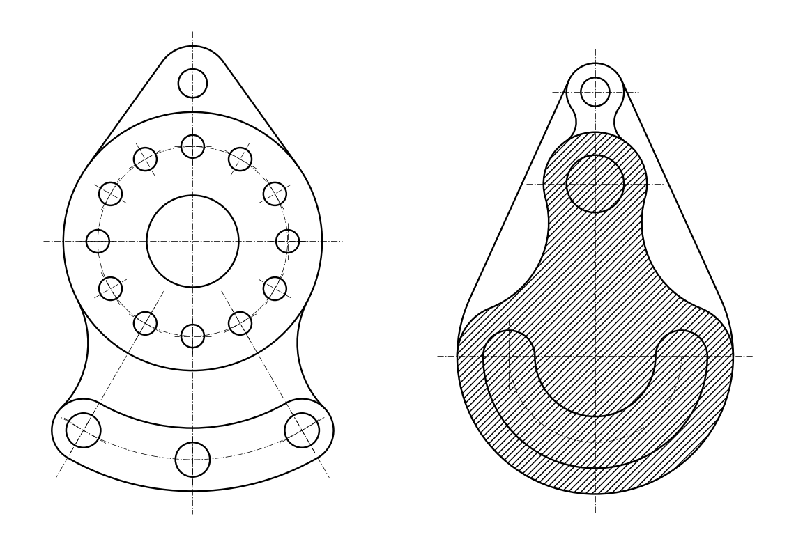

# Чертежи для КОМПАС-3D (.frw) по фото задания

Чертежи построены по размерам из задания, без простановки размеров.
Все сопряжения и касательные вычислены точно.

| Вариант | Детали | Превью |
|---|---|---|
| 1 | Гитара, Корпус |  |
| 10 | Серьга, Корпус |  |

## Как получить `.frw`

**Способ 1 — макрос (сразу создаёт `ВариантN.frw`):**
1. Открыть КОМПАС-3D.
2. Приложения → Python → запустить `kompas_macro_v1.py` или `kompas_macro_v10.py`
   (или из консоли Windows: `pip install pywin32`, затем `python kompas_macro_v10.py`).
3. Макрос создаст фрагмент, начертит обе детали (основные и осевые линии, штриховку)
   и сохранит `ВариантN.frw` рядом со скриптом.

**Способ 2 — через DXF:**
Файл → Открыть → `Вариант1.dxf` / `Вариант10.dxf` → Файл → Сохранить как → «Фрагмент (*.frw)».

## Файлы
- `geometry.py` — общие функции и геометрия варианта 1;
- `variant10.py` — геометрия варианта 10;
- `build.py` — генерирует DXF, макросы и превью для всех вариантов (`python build.py`);
- `kompas_macro_v*.py` — макросы для КОМПАС-3D (API5);
- `Вариант*.dxf` — те же чертежи в DXF (слои «Основная», «Тонкая», «Осевая»).
