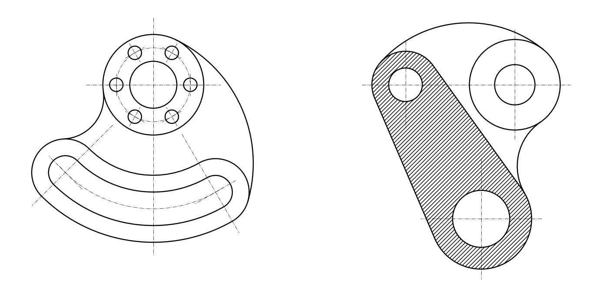

# Вариант 1 — «Гитара» и «Корпус» (фрагмент КОМПАС .frw)

Чертёж построен по размерам из задания, без простановки размеров.
Все сопряжения (R25, R82, R70, R32, касательные рычага) вычислены точно.

## Как получить `.frw`

**Способ 1 — макрос (сразу создаёт `Вариант1.frw`):**
1. Открыть КОМПАС-3D.
2. Приложения → Python → запустить `kompas_macro.py`
   (или из консоли Windows: `pip install pywin32`, затем `python kompas_macro.py`).
3. Макрос создаст фрагмент, начертит обе детали (основные и осевые линии, штриховку)
   и сохранит `Вариант1.frw` рядом со скриптом.

**Способ 2 — через DXF:**
Файл → Открыть → `Вариант1.dxf` → Файл → Сохранить как → «Фрагмент (*.frw)».

## Файлы
- `geometry.py` — расчёт геометрии (все размеры задания);
- `build.py` — генерирует `Вариант1.dxf`, `kompas_macro.py`, `preview.png`;
- `kompas_macro.py` — макрос для КОМПАС-3D (API5);
- `Вариант1.dxf` — тот же чертёж в DXF (слои «Основная», «Тонкая», «Осевая»).
